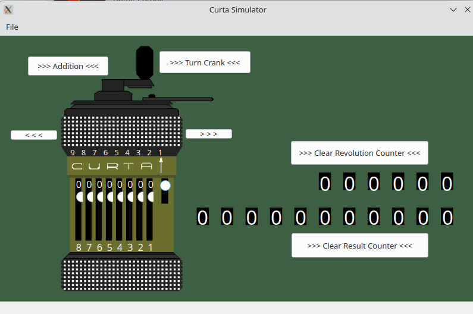

# Curta Simulator

Projekt zaliczeniowy na zajęcia z przedmiotu "Języki i Paradygmaty Projektowania". </br>
Training project for university course "Languages and Programming Paradigms".

## Technologies
Project is created with:
* C++11
* Qt5

## Setup
To build this project, install qmake and navigate to project directory:

```
qmake .
make
```

## Views


